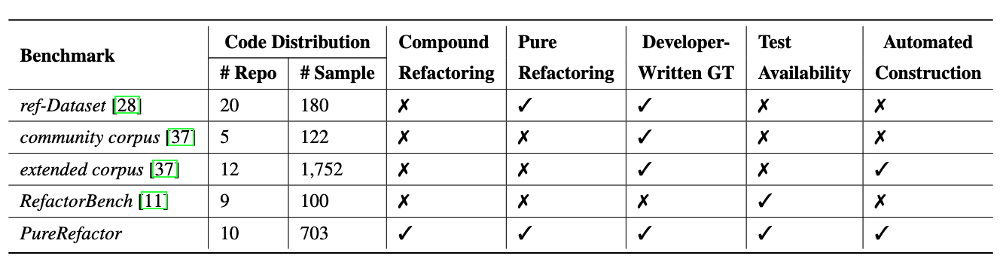
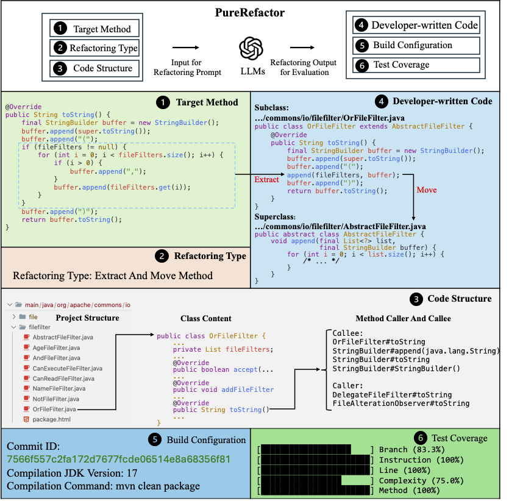
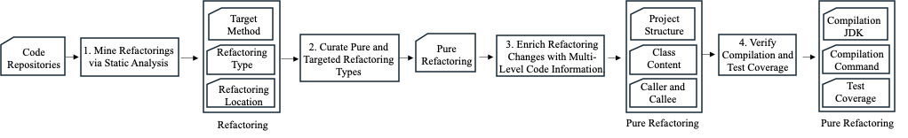
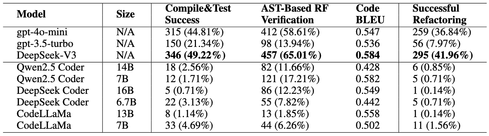

# PureRefactor

**PureRefactor** is a new benchmark for evaluating LLM-based code refactoring. It contains **703 real-world, pure refactorings** collected from **10 Java projects**.

Each refactoring instance is verified through:
- Compilation  
- Test execution  
- Automated refactoring detection tools  

This ensures the correctness and purity of each refactoring.

Compared to existing refactoring benchmarks such as **ref-Dataset**, **community corpus**, **extended corpus**, and **RefactorBench**,  
**PureRefactor** stands out in several key aspects:

- Includes both **atomic and compound** refactorings.
- Guarantees **pure** refactorings with no entangled changes.
- Provides **developer-written** ground truth and test cases.
- Ensures **test availability** for correctness validation.
- Built through a **fully automated pipeline** from real project commits.

**👉 Details of PureRefactor can be found at:**  
[https://huggingface.co/datasets/easenxu/PureRefactor](https://huggingface.co/datasets/easenxu/PureRefactor)

## Metadata

## PureRefactor Sample Schema

Each sample in the **PureRefactor** benchmark contains the following fields:

### Basic Information
- **`type`** *(string)*  
  Type of the applied refactoring (e.g., `Inline Method`).

- **`description`** *(string)*  
  A concise summary of the refactoring action, including involved methods and visibility changes.

- **`projectName`** *(string)*  
  Name of the project containing the refactoring (e.g., `checkstyle`).

- **`commitId`** *(string)*  
  Git commit hash where the refactoring was applied.

- **`uniqueId`** *(string)*  
  A unique identifier derived from commit and line information.

---

### Location & Structure

- **`diffLocations`** *(list of dicts)*  
  Each dictionary contains:
  - `filePath`: path of the modified file.
  - `startLine`, `endLine`: start/end line numbers.
  - `startColumn`, `endColumn`: start/end column numbers.

- **`filePathBefore`** *(string)*  
  File path before the refactoring.

- **`filePathAfter`** *(string)*  
  File path after the refactoring (if moved).

- **`moveFileExist`** *(bool)*  
 Indicates whether the **target class exists** in the destination file after the method was moved.

---

### Code Snippets

- **`sourceCodeBeforeRefactoring`** *(string)*  
  The method body before refactoring.

- **`sourceCodeAfterRefactoring`** *(string)*  
  The method body after refactoring.

- **`sourceCodeBeforeForWhole`** *(string)*  
  Full content of the file before refactoring.

- **`sourceCodeAfterForWhole`** *(string)*  
  Full content of the file after refactoring.

- **`diffSourceCode`** *(string)*  
  Line-level diff between the before/after versions.

---

### Code Metadata

- **`methodNameBefore`** *(string)*  
  Fully qualified method name before refactoring.

- **`classNameBefore`** *(string)*  
  Fully qualified class name before refactoring.

- **`classSignatureBefore`** *(string)*  
  Declaration of the class (e.g., `class SinglelineDetector`).

- **`callInfo`** *(string)*  
  Call relationships relevant to the refactoring; `"N/A"` if unavailable.

---

### Purity Validation

- **`isPureRefactoring`** *(bool)*  
  Whether the change is a pure refactoring (no semantic/feature change).

- **`purityCheckResultList`** *(list of dicts)*  
  Each dict includes:
  - `isPure`
  - `purityComment`
  - `description`
  - `mappingState`

---

### Compilation & Testing

- **`compileResultBefore`** *(bool)*  
  Whether the project compiled successfully before refactoring.

- **`compileResultCurrent`** *(bool)*  
  Whether the project compiles successfully after refactoring.

- **`compileJDK`** *(int)*  
  Java version used for compilation (e.g., `11`).

- **`compileCommand`** *(string)*  
  Maven command used for compiling the project.

- **`hasTestC`** *(bool)*  
  Whether the refactored method is covered by any test cases.

- **`coverageInfo`** *(dict)*  
  Test coverage statistics:
  - `INSTRUCTION`, `LINE`, `COMPLEXITY`, `METHOD`: each with `missed` and `covered`.

<!-- ## Automatic Pipeline for Constructing PureRefactor

PureRefactor is built through a four-step automated pipeline:

1. **Mine Refactorings**  
   Use static analysis to extract refactorings from real Java repositories.

2. **Filter Pure Refactorings**  
   Retain only behavior-preserving and targeted refactoring types.

3. **Enrich with Context**  
   Add project structure, class content, and caller/callee information.

4. **Verify Correctness**  
   Ensure compilation and test coverage to guarantee validity.

This process ensures the benchmark is fully automated, reliable, and free from manual or LLM-induced bias. -->

## Experimental Results Folder

The `experimental result` directory contains all evaluation outputs on **PureRefactor**.

It is organized by prompting strategy:
- `multi-agent`
- `rag`
- `simple prompt`

Under each strategy, we include results from 9 widely-used LLMs, such as:
- GPT-4o-mini, GPT-3.5-turbo-0125
- DeepSeek Coder (6.7B & 16B), DeepSeek-Chat
- CodeLlama (7B & 13B)
- Qwen2.5 Coder (7B & 14B)

Each folder contains model-specific refactoring results.

At the root, the file `Experiment result on PureRefactor.xlsx` summarizes overall success rates and detailed comparisons across all strategies and models.

## Code Folder

The `code` directory contains all scripts and configurations for constructing and evaluating **PureRefactor**.

### Subdirectories
- **`rag/`**: Code for building contextual Retrieval-Augmented Generation (RAG) and retrieving relevant examples.
- **`data/`**: Includes static tools, prompt templates, and temporary runtime folders.
- **`model/`**: Defines the core refactoring entities used throughout the pipeline.

### Key Files
- **`config.yaml`**: Configuration file for evaluating PureRefactor.
- **`requirements.txt`**: Python dependencies for running the evaluation.
- **`multiple_agent_rag_refactoring_main.py`**: Implementation of the RAG and multi-agent workflow.
- **`llm_refactoring/`**: Implementation of simple prompt strategy.
- **`pre_process_data/`**: Scripts for constructing the PureRefactor benchmark.
- **`clone.sh`**: Script to clone target project repositories.

### Prompts
Here we list the prompts for all workflow:
[Prompts](./code/data/prompts/extract_and_move_method_baseline_prompt.txt)

### Configuration
There are four configurations in config.yaml that need to be set.
* project_prefix_path: {Path to your project directory, e.g., /Users/xxx/xxx/PureRefactor/code}
* OPENAI_API_KEY: {Your OpenAI API key}
* chromadb_host: {ChromaDB host address; use "localhost" if running ChromaDB locally}
* project_name: {Name of the evaluation project, e.g., "commons-io"}

### How to run the code

#### Set up

* install the requirements.
* install the chromadb vector database.
    * the guide link: [trychroma](https://docs.trychroma.com/)
    * once the installation is complete, you need to configure chromadb_host in the config.yaml.
    * it is recommended to use a local [Docker installation](https://docs.trychroma.com/production/containers/docker#run-chroma-in-a-docker-container), as it is more convenient.
* install the jenv, a tool for switching between different Java versions.
    * the guide link: [jenv](https://github.com/jenv/jenv)
    * install Java 8, Java 11, Java 17, and Java 21 using jenv
* install the build system (Maven and Gradle)
* run clone.sh to clone the project code to be analyzed
* configure project_prefix_path, OPENAI_API_KEY, project_name in the config.yaml.

#### Automatic pipeline for construction PureRefactor
* cd ./code/data/tools/RefactoringMiner-3.0.10/bin
* ./RefactoringMiner -pbc {project_path} {start_commit} {end_commit} e.g. ./RefactoringMiner -pbc /RefactoringMiner/tmp/checkstyle 0ae1b19ddf4167c3d3fdc2544980a00927c9b974 b007d563c4f9da44040452a8a9de2b76bc64875e
* python pre_process_data.py

#### Evaluation
* python llm_refactoring.py
* python multiple_agent_rag_refactoring_main.py

#### Result

